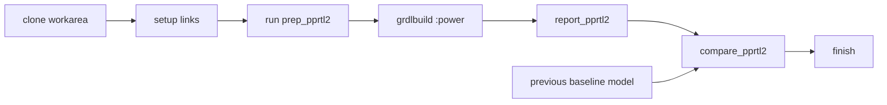

# COR PPRTL2 Workflow

## Flow Overview



<u>**Details**</u>
- Clone the soc repo.  Runs will be performed in the created workarea.
- Setup links to the reference model, SDC archive, and maybe the MTL file.
  - **NOTE:** No build is required with this flow.  The input collaterals are taken from an existing GK release model.
- Run the prep_pprtl2 script to generate the pprtl2 workarea for the partitions.
- Run the PPRTL2 power analysis flow using grdlbuild.
- Generate the run reports using report_pprtl2.  You can run while the runs are in progress.
- Options: Compare the results with the previous baseline model.


## Reference Model Lookup

### IMH

/nfs/site/disks/corhub_fe_mod_0000/corhub_oks/corhub_oks-a0-corhub_oks-26ww29m  
/nfs/site/disks/corimh.arc.proj_archive/arc/parsocnorthcap0a/clock_collateral  
DUT=imh  
TOP_IP_NAME=imh
H2B_PASS=trial

### IOH

/nfs/site/disks/dmr_fe_mod_0000/dmrhub2/dmrhub2-a0-corioh-26ww29c
/nfs/site/disks/dmr2_arc_proj_archive/arc/parcgu/clock_collateral  
DUT=ioh  
TOP_IP_NAME=ioh  
H2B_PASS=trial

### CBBP

/nfs/site/disks/corcbb_fe_mod_0000/corcbbp/corcbbp-a0-corcbbp-26ww29g
/nfs/site/disks/corcbbp.arc.proj_archive/arc/par_base_ese_cse/clock_collateral  
DUT=cbb0  
TOP_IP_NAME=soc        # mroha: Why...
H2B_PASS=cbb0

**Note:** activity_dir.map is still required for all 3 dies
- IMH is on a 2025 CTH release that does not have pprtl2
- IOH is on a 2023 CTH release that does not have pprtl2
- CBBP is on a 2026 CTH release, but their setup is incorrect for CENTRAL_TOOL_ORDER (see $WORKAREA/tool.cth)

## COR IMH

### COR IMH Setup

```sh
/p/cth/bin/cth_psetup -p cor_fe -cfg cor_fe.cth -read_only
git config --global --add safe.directory /nfs/site/disks/corhub_fe_git_0001/corhub_oks-a0
git clone $GIT_REPOS/corhub_oks-a0 corhub_oks-a0-pprtl2-partitions
cd corhub_oks-a0-pprtl2-partitions

# bash
export WORKAREA=`realpath .`
export FE_ACTIVITY_MAPPING=$WORKAREA/power/pprtl2/activity_dir.map

# tcsh
setenv WORKAREA `realpath .`
setenv FE_ACTIVITY_MAPPING $WORKAREA/power/pprtl2/activity_dir.map

# Create pprtl2 workdir
mkdir -p $WORKAREA/power/pprtl2 
cd $WORKAREA/power/pprtl2

# Create symlinks to reference model and SDC archive
# This is a human action
# Typically I look at the "latest" model and link to that version.
# Fill in YOUR_MODEL_VERSION_HERE with the one you selected
ln -sfn /nfs/site/disks/corhub_fe_mod_0000/corhub_oks/YOUR_MODEL_VERSION_HERE REF_MODEL
ln -sfn /nfs/site/disks/corimh.arc.proj_archive/arc SDC_ARCHIVE
ln -sfn <path to mtl> MTL_FILE
ln -sfn /nfs/site/disks/corimhoks_rtl_h2b_011/mroha/scripts scripts

# mroha: TODO: Turnin scripts/ to $WORKAREA/power/pprtl2
# Generate pprtl2 workarea
python3 scripts/pprtl2/prep_pprtl2.py --force --dut imh
```

### COR IMH Workflow

```sh
# Run one partition locally
grdlbuild :power:parfws --project-dir $WORKAREA/power/pprtl2/grdlbuild -Pdut=imh -Ptopip=imh -Ph2b_pass=trial

# Run three partitions via netbatch
grdlbuild :power:parfws :power:pars3m :power:parocs --project-dir $WORKAREA/power/pprtl2/grdlbuild -Pdut=imh -Ptopip=imh -Ph2b_pass=trial -nb

# Run three partitions via netbatch, skip vectorless runs
grdlbuild :power:parfws :power:pars3m :power:parocs --project-dir $WORKAREA/power/pprtl2/grdlbuild -Pdut=imh -Ptopip=imh -Ph2b_pass=trial -Pskip_vectorless=true -nb

# Run all partitions via netbatch
grdlbuild :power --project-dir $WORKAREA/power/pprtl2/grdlbuild -Pdut=imh -Ptopip=imh -Ph2b_pass=trial -nb
```

### COR IMH Post Run Report

```sh
python3 scripts/pprtl2/report_pprtl2.py --dut imh
```


## COR IOH

### COR IOH Setup

```sh
/p/cth/bin/cth_psetup -p dmr_fe -cfg dmr_fe_dmrhub2.cth -read_only
git config --global --add safe.directory /nfs/site/disks/dmr_fe_git_0001/dmrhub2-a0
git clone $GIT_REPOS/dmrhub2-a0 -b corioh dmrhub2-a0-corioh-pprtl2-partitions
cd dmrhub2-a0-corioh-pprtl2-partitions

# bash
export WORKAREA=`realpath .`
export FE_ACTIVITY_MAPPING=$WORKAREA/power/pprtl2/activity_dir.map

# tcsh
setenv WORKAREA `realpath .`
setenv FE_ACTIVITY_MAPPING $WORKAREA/power/pprtl2/activity_dir.map

# Create pprtl2 workdir
mkdir -p $WORKAREA/power/pprtl2
cd $WORKAREA/power/pprtl2


# Create symlinks to reference model, SDC archive, and optionally the MTL file
# This is a human action
# Typically I look at the "latest" model and link to that version.
# Fill in YOUR_MODEL_VERSION_HERE with the one you selected
ln -sfn /nfs/site/disks/dmr_fe_mod_0000/dmrhub2/YOUR_MODEL_VERSION_HERE REF_MODEL
ln -sfn /nfs/site/disks/dmr2_arc_proj_archive/arc SDC_ARCHIVE
ln -sfn /nfs/site/disks/xpg_dmrhub_0922/mmuralid2/MTL/CORIOH/WW33/ww33b_corioh_control.mtl MTL_FILE
ln -sfn /nfs/site/disks/corimhoks_rtl_h2b_011/mroha/scripts scripts


# mroha: TODO: Turnin scripts/ to $WORKAREA/power/pprtl2
# Generate pprtl2 workarea
python3 scripts/pprtl2/prep_pprtl2.py --force --dut ioh
```

### COR IOH Workflow

```sh
# Run one partition locally
grdlbuild :power:parfws --project-dir $WORKAREA/power/pprtl2/grdlbuild -Pdut=ioh -Ptopip=ioh -Ph2b_pass=trial

# Run three partitions via netbatch
grdlbuild :power:parfws :power:parsocsouthcap1c :power:paraccpsfchannel :power:parmioufiflop_uio_00 --project-dir $WORKAREA/power/pprtl2/grdlbuild -Pdut=ioh -Ptopip=ioh -Ph2b_pass=trial -nb

# Run three partitions via netbatch, skip vectorless runs
grdlbuild :power:parfws :power:parsocsouthcap1c :power:paraccpsfchannel :power:parmioufiflop_uio_00 --project-dir $WORKAREA/power/pprtl2/grdlbuild -Pdut=ioh -Ptopip=ioh -Ph2b_pass=trial -Pskip_vectorless=true -nb

# Run all partitions via netbatch
grdlbuild :power --project-dir $WORKAREA/power/pprtl2/grdlbuild -Pdut=ioh -Ptopip=ioh -Ph2b_pass=trial -nb
```

### COR IOH Post Run Report

```sh
python3 scripts/pprtl2/report_pprtl2.py --dut ioh
```


## COR CBBP

### COR CBBP Setup

```sh
/p/cth/bin/cth_psetup -p cor_fe -cfg corcbbp_fe.cth -read_only
git config --global --add safe.directory /nfs/site/disks/corcbb_fe_git_0001/corcbbp-a0
git clone $GIT_REPOS/corcbbp-a0 corcbbp-a0-pprtl2-partitions
cd corcbbp-a0-pprtl2-partitions

# bash
export WORKAREA=`realpath .`
export FE_ACTIVITY_MAPPING=$WORKAREA/power/pprtl2/activity_dir.map

# tcsh
setenv WORKAREA `realpath .`
setenv FE_ACTIVITY_MAPPING $WORKAREA/power/pprtl2/activity_dir.map

# Create pprtl2 workdir
mkdir -p $WORKAREA/power/pprtl2
cd $WORKAREA/power/pprtl2

# Create symlinks to reference model and SDC archive
# This is a human action
# Typically I look at the "latest" model and link to that version.
# Fill in YOUR_MODEL_VERSION_HERE with the one you selected
ln -sfn /nfs/site/disks/corcbb_fe_mod_0000/corcbbp/YOUR_MODEL_VERSION_HERE REF_MODEL
ln -sfn /nfs/site/disks/corcbbp.arc.proj_archive/arc SDC_ARCHIVE
ln -sfn <path to mtl> MTL_FILE
ln -sfn /nfs/site/disks/corimhoks_rtl_h2b_011/mroha/scripts scripts

# mroha: TODO: Turnin scripts/ to $WORKAREA/power/pprtl2
# Generate pprtl2 workarea
python3 scripts/pprtl2/prep_pprtl2.py --force --dut cbb0
```

### COR CBBP Workflow

```sh
# Run one partition locally
grdlbuild :power:par_base_ese_cse --project-dir $WORKAREA/power/pprtl2/grdlbuild -Pdut=cbb0 -Ptopip=soc -Ph2b_pass=cbb0

# Run two partitions via netbatch
grdlbuild :power:par_base_ese_cse :power:par_compute_fabric --project-dir $WORKAREA/power/pprtl2/grdlbuild -Pdut=cbb0 -Ptopip=soc -Ph2b_pass=cbb0 -nb

# Run two partitions via netbatch, skip vectorless runs
grdlbuild :power:par_base_ese_cse :power:par_compute_fabric --project-dir $WORKAREA/power/pprtl2/grdlbuild -Pdut=cbb0 -Ptopip=soc -Ph2b_pass=cbb0 -Pskip_vectorless=true -nb

# Run all partitions via netbatch
grdlbuild :power --project-dir $WORKAREA/power/pprtl2/grdlbuild -Pdut=cbb0 -Ptopip=soc -Ph2b_pass=cbb0 -nb
```

### COR CBBP Post Run Report

```sh
python3 scripts/pprtl2/report_pprtl2.py --dut cbb0
```

## Backup notes

### How To: compare multiple pprtl2 runs

You can compare multiple pprtl2 runs using the following command

```sh
python3 scripts/pprtl2/compare_pprtl2.py --models-for-compare compare.md
```

Example content of compare.md file:

```ini
# compare_pprtl2 input model list
# format is <model>=<workarea>
# You can add as many models as needed for comparison

26ww27a=/nfs/site/disks/corimhoks_rtl_h2b_011/mroha/dmrhub2-a0-corioh-pprtl2-partitions-b
26ww32d=/nfs/site/disks/corimhoks_rtl_h2b_011/mroha/dmrhub2-a0-corioh-pprtl2-partitions-c
```

### How To: Run pprtl2 on a single partition outside of grdlbuild

```sh
# IMH example
make -C $WORKAREA/power/pprtl2 elab DUT=imh TOP_IP_NAME=imh TOP_MODULE_NAME=pars3m CONFIG=partition/pars3m.timebased.flow.cfg

# IOH example
make -C $WORKAREA/power/pprtl2 elab DUT=ioh TOP_IP_NAME=ioh TOP_MODULE_NAME=pars3m CONFIG=partition/pars3m.timebased.flow.cfg

# CBBP example
make -C $WORKAREA/power/pprtl2 elab DUT=cbb0 TOP_IP_NAME=soc TOP_MODULE_NAME=par_base_ese_cse CONFIG=partition/par_base_ese_cse.timebased.flow.cfg
```
